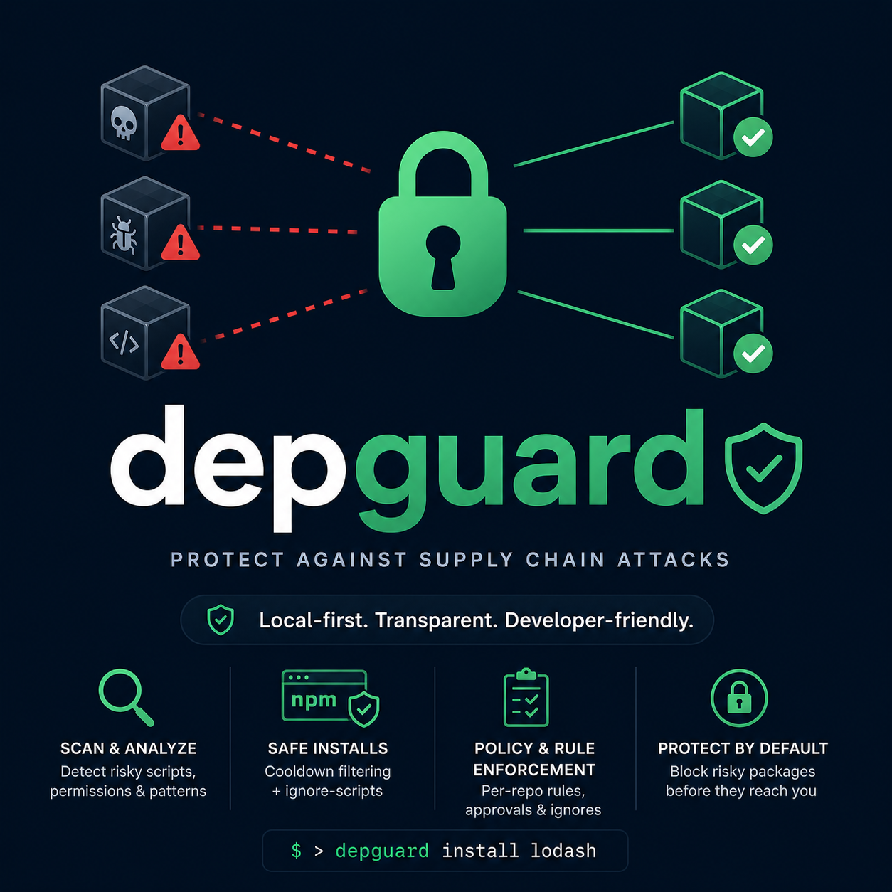
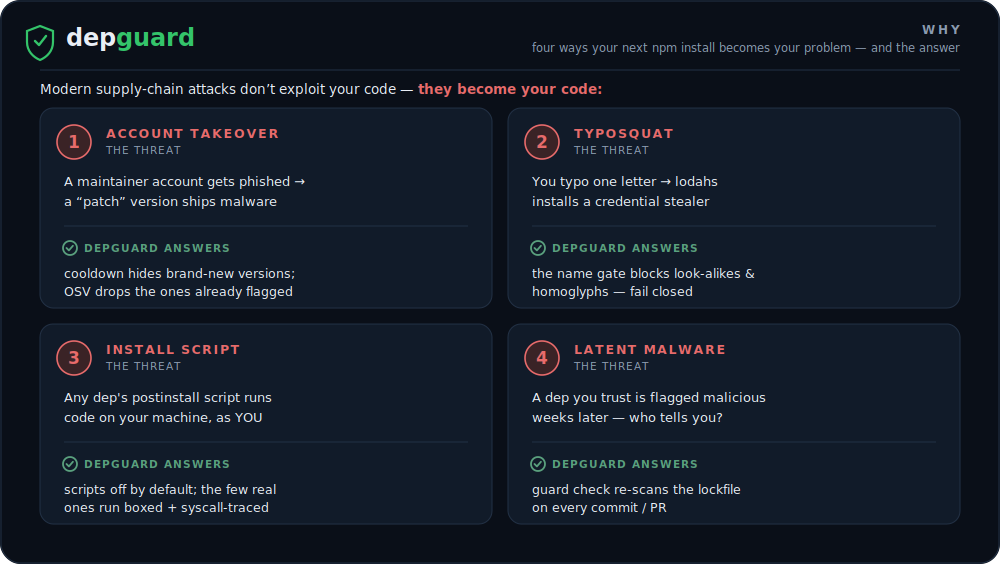
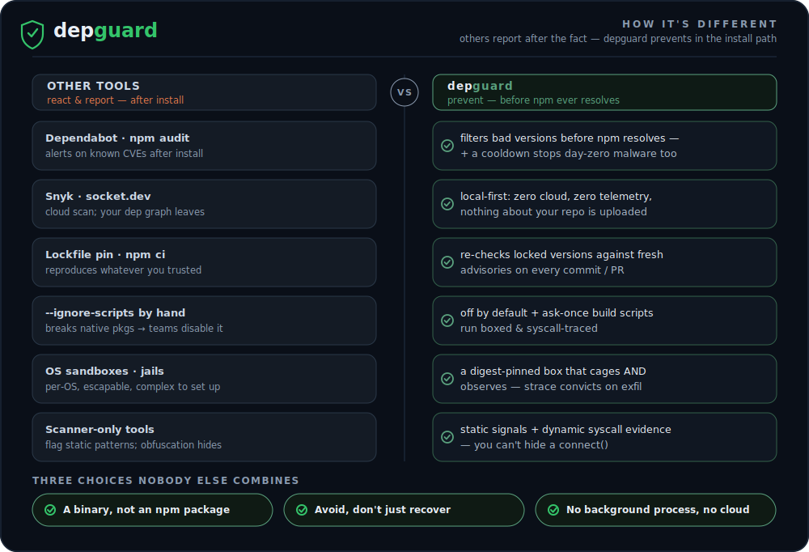
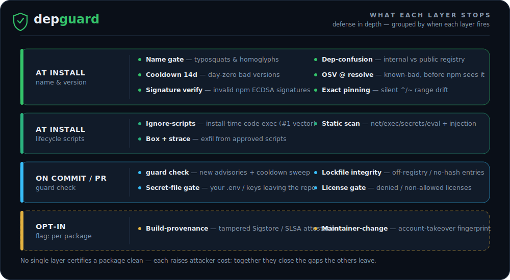
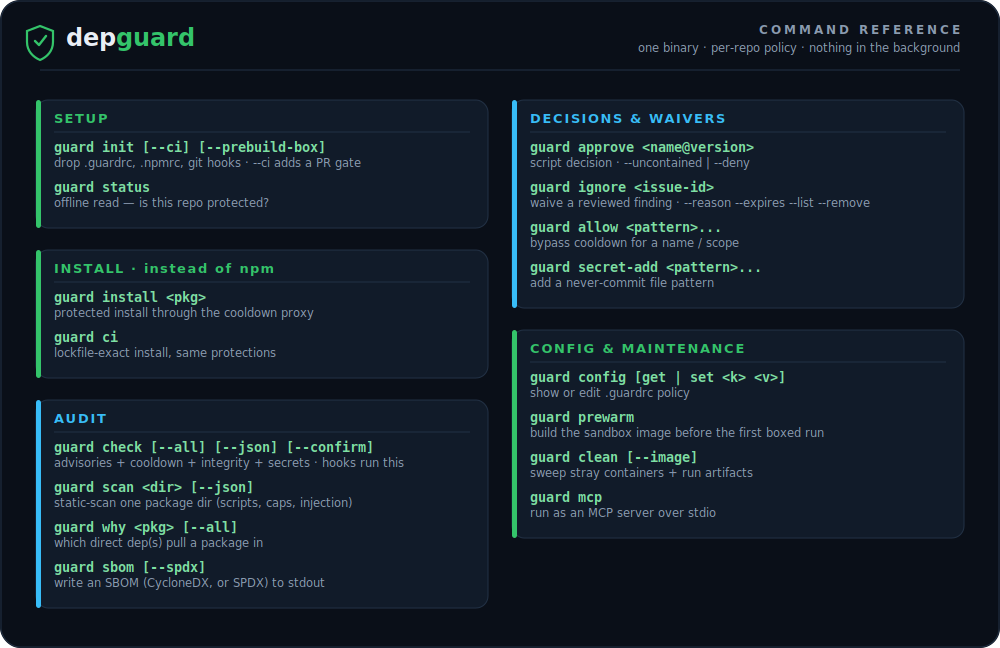

<div align="center">



<br>


**Your next `npm install` is the easiest way into your machine. depguard closes it.**

One self-contained binary · zero dependencies · nothing running in the background.
Protection fires only when *you* act — install, commit, PR.

</div>

---

## Contents

- [Why](#why) · [How it works](#how-it-works) · [How it's different](#how-its-different) · [Quickstart](#quickstart)
- [The five layers](#the-five-layers) · [What each layer stops](#what-each-layer-stops)
- [Command reference](#command-reference) · [Per-repo files](#per-repo-files-commit-them)
- [Honest limits](#honest-limits) · [What's next](#whats-next) · [Tests](#tests) · [Docs](#docs)

## Why

Modern supply-chain attacks don't exploit your code — they *become* your code:

<div align="center">
  
</div>

Audits and scanners react *after* the damage. depguard sits in the install path
and makes the malicious version something npm **never even sees**.

> **Not installed through npm — on purpose.** A security tool that ships through
> the ecosystem it protects is itself a supply-chain target. depguard's binary
> lives on your machine; only policy lives in your repo (committed files — no
> accounts, no cloud, no telemetry).

## How it works

A package's full journey — from `guard install` through every layer to a trusted merge:

<div align="center">
  
</div>

Each numbered gate is one of depguard's defense layers — see [the five layers](#the-five-layers) and [what each one stops](#what-each-layer-stops) for the deeper dive.

<details><summary><b>Text version of the flow</b></summary>

```
 guard install lodash
       │
       ▼
 ┌─────────────────────────────┐
 │ ephemeral proxy (this cmd   │  versions younger than the cooldown are
 │ only) filters what npm SEES │  invisible → npm picks a safe one itself
 └─────────────────────────────┘
       │  --ignore-scripts: lifecycle scripts never auto-run
       │  save-exact: new deps pinned to the exact version (no ^/~)
       ▼
 script-bearing packages (the few) → static scan shown → you approve once
       │                              → script runs BOXED + TRACED (docker:
       │                                no network, read-only tree, own dir
       │                                writable, strace watching syscalls)
       │                              → exfil/secret-access attempt? output
       │                                discarded, approval auto-revoked
       ▼
 OSV advisory check on the final lockfile
```

</details>

See it live: `node demo/run.mjs` ([demo/README.md](demo/README.md)).

**What a block looks like** — `guard check` stops a staged secret before it ever leaves your machine:

```console
$ guard check
guard: ✗ 1 secret file(s) would be committed/pushed:
  .env  (matched secret-paths ".env")
guard: untrack it first — git rm --cached <file> (and add it to .gitignore).
guard: a deliberate file? → guard ignore secret:.env --reason "..."
guard: 1 secret file(s) staged or tracked
```

## How it's different

Most tools in this space **report** — they tell you, after the fact, that
something you already installed is bad. depguard sits *in the install path* — so npm
never resolves the bad version in the first place.

<div align="center">
  
</div>

| You might use… | What it does | Where depguard differs |
|---|---|---|
| **Dependabot / `npm audit`** | alert on known CVEs *after* install, from a public advisory DB | filters bad versions out **before npm resolves**, and adds a **cooldown** that stops day-zero malware no advisory has named yet |
| **Snyk / socket.dev** | cloud service scans your manifest, dashboards + per-seat pricing, your dep graph leaves the building | **local-first, zero cloud, zero telemetry, no accounts** — state is committed files; nothing about your repo is uploaded |
| **Lockfile pinning / `npm ci`** | reproducible installs of whatever you already trusted — including a version poisoned before you pinned it | re-checks the locked versions against fresh advisories on **every commit/PR**, and verifies registry signatures + lockfile integrity |
| **`--ignore-scripts` by hand** | blocks *all* lifecycle scripts; native packages break, so teams turn it back off | ignore-by-default **plus** an ask-once approval that runs the few real build scripts **boxed and syscall-traced** — protection without the breakage |
| **OS sandboxes / per-OS jails** | contain script execution, but per-OS, escapable, complex to set up | a digest-pinned container that both **cages and observes** (strace convicts on exfil intent) — and when no runtime exists, every other layer still works |
| **Scanner-only tools** | flag suspicious *static* patterns; obfuscation hides from a code reader | pairs static signals with **dynamic syscall evidence** — you can hide a `connect()` from a reader, not from the trace |

## Quickstart

**Requirements:** Go 1.26.4 to build the binary, `git` for commit-diff scoping, and *optionally* Docker or Podman to sandbox build scripts. End users just need the compiled binary.

```sh
# 1. Build the binary once per machine (Go 1.26.4, zero dependencies)
go build -o guard .
sudo mv guard /usr/local/bin/      # or anywhere on your PATH

# 2. Protect a repo
cd your-project
guard init                          # drops .guardrc, .npmrc, pre-commit/pre-push hooks
guard install lodash                # instead of npm install
```

End users need only the compiled binary — never Go, never npm packages. Full
onboarding, cross-compiling, tuning, and troubleshooting: **[docs/SETUP.md](docs/SETUP.md)**.

## The five layers

Defense in depth — five independent layers, no single one claimed to certify a
package clean:

```
 ① AVOID        cooldown + advisory filtering — risky versions become invisible
 ② CATCH        static scan — scripts, capabilities, obfuscation, injection prose
 ③ NEUTRALIZE   ignore-scripts by default — untrusted setup code never auto-runs
 ④ CONTAIN      approved scripts run boxed (no network, no secrets) + syscall-traced
 ⑤ RECOVER      every commit/PR re-checks the lockfile against fresh advisories
```

The *why* and the per-layer guarantees: **[docs/DESIGN.md](docs/DESIGN.md)** (the contract).

## What each layer stops

The same layered defenses — but they don't all fire at once. Here they're grouped by **when** each runs:

<div align="center">
  
</div>

### At install · name & version safety — *before npm even resolves*

`guard install` / `guard ci`, via the ephemeral proxy:

| Layer | Stops |
|---|---|
| Typosquat / homoglyph name gate | impostor names: one-edit look-alikes (`lodahs`) and non-ASCII homoglyphs (`reаct`) |
| Dependency-confusion gate | `internal-scopes` names resolving against the public registry |
| Cooldown (default 14d) | freshly-published malicious versions (most are yanked within days) |
| OSV at resolve time | known-bad versions, dropped *before* npm resolves |
| Registry signature verification | a present-but-invalid npm ECDSA signature on a version |
| Exact version pinning (`.npmrc` `save-exact`) | silent `^`/`~` range drift on a later `npm install` |

These all run inside the ephemeral proxy, so a blocked version is simply one npm
never resolves — no error to handle. The name gate is **fail-closed**; clear a false
match with `allow:`. The cooldown makes too-fresh versions invisible, so npm picks a
safe one itself. Signature verification catches registry/account tampering the
integrity hash can't — but only blocks *present-but-invalid* signatures (unsigned
versions still pass). With `save-exact`, deps stay at the version you vetted until you
bump them by hand, so a later `npm install` can't pull a freshly-compromised patch.

### At install · lifecycle scripts — *only the few packages that ship them*

| Layer | Stops |
|---|---|
| Ignore-scripts (`guard` + `.npmrc`) | install-time code execution, the #1 npm attack vector — even via plain npm |
| Static scan at approval | network, child_process, secret-path, and eval signals, **plus LLM/agent-injection** (prompt-injection prose, Trojan-Source bidi, zero-width hiding) for when an agent reviews your deps |
| Boxed + traced script run | exfil from approved scripts — the container both **cages and watches** (detail below) |

When you approve a script, it runs in a **digest-pinned container**: no network, no
secrets, no-new-privileges, pids-limited, and **seccomp**-filtered (io_uring, the
kernel keyring, and bpf/perf are blocked). On top of that, **strace watches every
syscall**. A `connect()` to a real host or a read of `/root/.ssh` auto-convicts: the
output is discarded and the approval revoked. The container is named and force-removed
on timeout; `guard prewarm` builds the image ahead of the first run, `guard clean
--image` reclaims it.

### On commit / push / PR — *`guard check`, run by the git hooks & CI gate*

Catches deps that go bad *after* you installed them — and your own secrets on the way out:

| Layer | Stops |
|---|---|
| `guard check` (advisories + cooldown) | newly-reported advisories + cooldown violations across **every version** in the tree, on every commit/PR (detail below) |
| Lockfile integrity check | entries whose tarball resolves off-registry or carry no integrity hash (poisoned lockfile) |
| Secret-file gate (opt-in) | **your own** credential files (`.env`, `secrets/`, keys) staged or already tracked by git — hard-blocks commit/push so they never reach the remote (`secret-paths` in .guardrc); waive a deliberate match with `guard ignore secret:<path>` |
| License-policy gate (opt-in) | installed packages under a denied (or, in allowlist mode, non-allowed) license — `license-deny` / `license-allow` in .guardrc |

**How `guard check` grades and recovers.** Advisories are tiered: high+/`MAL-*`/unscored
**block**, moderate/low **warn** (tune with `advisory-threshold`). Cooldown violations
are caught across every distinct version in the tree, whichever install path introduced
them; `flag: new-deps` also lists packages a change adds. At a terminal (`--confirm`,
which the hooks pass) a cooldown hit offers **accept-all** (waive them) or **pin &
reinstall** (drop each direct dep to its latest version past the cooldown, then
re-verify). CI always keeps the strict block.

### Opt-in deeper trust checks — *`flag:`, fetched per package (too heavy for every commit)*

| Layer | Stops |
|---|---|
| Build-provenance attestation | a published Sigstore/SLSA attestation that fails to verify (DSSE signature, Fulcio cert chain, or tarball-digest binding) — i.e. a tampered provenance claim (`flag: [provenance]`) |
| Maintainer-change | publisher changes / long-dormancy republishes on installed versions — the account-takeover fingerprint |

`guard check` scopes the cooldown re-check to lockfile versions **added since git
HEAD** — each version is vetted once, at the commit that introduces it. `--all`
forces a full-tree sweep.

The OSV advisory and registry-cooldown lookups are **fail-open**: a network blip
or an OSV outage must not block every commit, so the check never *gates* on them.
But it is never silent about it — the prose output warns (`advisory check
skipped: …`), and `guard check --json` (and the MCP `check_dependencies` tool)
list what couldn't run in a **`degraded`** array. A `degraded` result with
`ok: true` means *no findings were seen, but some layers didn't run* — treat it as
"incomplete," not "proven clean." CI that wants to be strict can fail on a
non-empty `degraded`.

## Command reference

<div align="center">
  
</div>

<details><summary><b>Full reference with every flag (copy-paste)</b></summary>

```sh
# ── Setup ──────────────────────────────────────────────────
guard init [--ci] [--prebuild-box]   # drop .guardrc, .npmrc, git hooks (--ci adds a PR gate;
                                     #   --prebuild-box builds the sandbox image now)
guard status                         # offline read: policy, hooks, sandbox, recorded decisions
#   bypass a hook once (depguard only, other hooks still run): GUARD_SKIP=1 git push

# ── Install · instead of npm ───────────────────────────────
guard install <pkg>                  # protected install through the cooldown proxy
guard ci                             # lockfile-exact install (npm ci), same protections

# ── Audit ──────────────────────────────────────────────────
guard check [--all] [--json] [--confirm] [--quiet]   # advisories + cooldown + integrity + secrets (hooks run this)
guard scan <dir> [--json]            # static-scan one package dir (scripts, caps, injection)
guard why <pkg> [--all]              # which direct dep(s) pull a package in (npm lockfile)
guard sbom [--spdx]                  # write an SBOM (CycloneDX, or SPDX) to stdout

# ── Decisions & waivers ────────────────────────────────────
guard approve <name@version> [--uncontained|--deny]            # script decisions
guard ignore <issue-id> [--reason ".."] [--expires 30d]        # waive a REVIEWED finding (--list, --remove)
guard allow <pattern>...             # add a name/scope to .guardrc allow (bypass cooldown)
guard secret-add <pattern>...        # append a file/dir pattern to secret-paths (never-commit gate)

# ── Config & maintenance ───────────────────────────────────
guard config [get | set <k> <v>]     # show or edit .guardrc policy
guard prewarm                        # build the sandbox image now so the first boxed run isn't slow
guard clean [--image]                # sweep stray containers + run artifacts (--image reclaims the image)
guard mcp                            # MCP server over stdio (tools: scan_package, check_dependencies)
```

</details>

Run `guard status` anytime for an offline, instant read on whether the repo is
protected — policy, the committed files, hooks, sandbox runtime, and recorded
approvals/waivers (it flags expired ones). Output is colorized on a terminal and
respects `NO_COLOR`.

## Per-repo files (commit them)

| File | Holds |
|---|---|
| `.guardrc` | policy: cooldown, allowed scopes, fallback mode, advisory severity threshold, secret-file paths — **review changes in PRs** (it controls the filter) |
| `.guard-approvals` | ask-once script decisions — **review changes in PRs** (they're security decisions) |
| `.guard-ignores` | reviewed-finding waivers — one per issue, version-pinned + optional expiry — **review changes in PRs** |
| `.npmrc` | `ignore-scripts=true` (even raw `npm install` can't run scripts) + `save-exact=true` (new deps pinned to the exact installed version — no `^`/`~`) |

## Honest limits

No layer claims 100%. Each raises attacker cost; together they close the gaps the
others leave.

- **Runtime malice is out of scope** — a dep that behaves badly when your app runs
  in production needs different tooling.
- The box needs Docker/Podman; without one, approved scripts follow the
  `no-container-fallback` policy (warn-then-approve; CI fails closed). Uncontained
  runs get a scrubbed environment (PATH/HOME/LANG only) — damage limitation, not
  containment.
- Static scan is signals, not proof — that's why approved scripts still run boxed
  and traced.
- Syscall observation uses `strace` inside the box (built locally from signed
  Debian packages — nothing installed on the host). It catches network reach-out,
  DNS queries, secret-path access, and process spawns. A kernel-level eBPF/Falco
  upgrade stays future work; if the strace image can't be built (offline), scripts
  still run CAGED but UNTRACED, and guard says so.
- A `.bin` entry from a malicious package still executes when *invoked* — install
  protection can't help once you run the code on purpose.
- `guard install` routes **npm, pnpm, and yarn** through the cooldown proxy
  (manager auto-detected from the lockfile). The **boxed lifecycle-script
  approval** flow stays npm-only — under pnpm/yarn scripts simply stay disabled
  (`--ignore-scripts`) and the lockfile re-check still runs.
- Signature verification **blocks only present-but-invalid** signatures; unsigned
  versions pass, because most of the ecosystem still is. Maintainer-change, the
  per-version capability diff, and build-provenance are **opt-in** (`flag:`) — they
  fetch per package, too heavy to run on every commit by default.
- Build-provenance verification checks the **DSSE signature, the Fulcio cert chain
  to a pinned Sigstore root, and the subject↔tarball digest binding**, then reports
  the attested source repo. It does **not** yet verify Rekor transparency-log
  inclusion, the SCT, or rotate trust roots via TUF — a green result is a high bar,
  not the full Sigstore guarantee.
- The MCP server returns scan/check results wrapped as **untrusted data**; an agent
  must still be told (as the banner says) not to follow instructions embedded in a
  package's files.

## What's next

Directional, not commitments — depguard is **npm-first** today. On the radar:

- **More ecosystems.** PyPI (Python) is the next target — a different registry API and
  script model — then NuGet (.NET / C#), Cargo (Rust), and RubyGems. The layered model
  (cooldown, name gate, scan, box, advisory re-check) is ecosystem-agnostic; each needs
  its own registry + lockfile adapter.
- **pnpm / yarn parity.** Installs already route through the cooldown proxy for all three;
  the **boxed lifecycle-script approval** is npm-only today (it reads `package-lock.json`)
  — extend it to the pnpm/yarn lockgraphs.
- **Richer tracing.** A kernel-level **eBPF / Falco**-style probe to complement `strace`
  inside the box.
- **Deeper provenance.** Verify **Rekor** transparency-log inclusion, the SCT, and **TUF**
  trust-root rotation — closing the gap to the full Sigstore guarantee.
- **Unused-dependency detection.** Surface declared deps that nothing actually
  imports — dead weight and needless attack surface — so they can be pruned
  (a `guard unused` report / a non-blocking `guard check` signal).
- **Signed release binaries.** Published, checksummed builds so you don't have to compile
  from source.

## Tests

Three layers of verification, all zero-dep:

- **Go unit tests** — `~/.local/go/bin/go test ./...` covers internal logic in
  isolation: parsers, matchers, the scan/trace/proxy decision functions, and the
  fail-closed branches.
- **Black-box e2e** (`test/`) — vitest spawns the **real compiled binary** against
  a mock npm registry with fabricated publish dates, so the cooldown is tested
  deterministically and nothing touches registry.npmjs.org.
- **Live demo as an acceptance check** (`demo/`) — `node demo/run.mjs` runs a cast
  of realistic packages (a clean install, a build that *looks* malicious but isn't,
  real exfil attempts caught by the box, a too-fresh version blocked) through the
  real binary and **asserts each outcome**, exiting non-zero if any scenario
  doesn't behave as documented — so it doubles as a smoke test. Safe by
  construction: the "malicious" packages target unroutable doc IPs and run with
  `--network none`. ([demo/README.md](demo/README.md))

```sh
cd test
npm install          # vitest only; the harness itself adds zero other deps
npm test             # builds the binary (globalSetup), runs the e2e suite

node demo/run.mjs    # the narrated demo also self-verifies every scenario
```

What the e2e suite proves, file by file: [test/README.md](test/README.md).

## Docs

| Doc | For | Covers |
|---|---|---|
| **[docs/DESIGN.md](docs/DESIGN.md)** | the contract — the *why* | goals/non-goals, the layered threat model, each layer's guarantee, design stance |
| **[docs/SETUP.md](docs/SETUP.md)** | onboarding | step-by-step setup **& cross-compiling**, `.guardrc` tuning, waiving findings, troubleshooting |
| **[docs/CODEMAP.md](docs/CODEMAP.md)** | contributors — the *where* | file/dir layout, what calls what, where to make which kind of change |
| [demo/README.md](demo/README.md) | demo runners | demo commands, scenario cast, safety guarantees |
| [test/README.md](test/README.md) | test authors | how the black-box suite runs, the mock-registry trick |

## License

[Apache 2.0](LICENSE) © 2026 Ethan Hoff — see [NOTICE](NOTICE).
