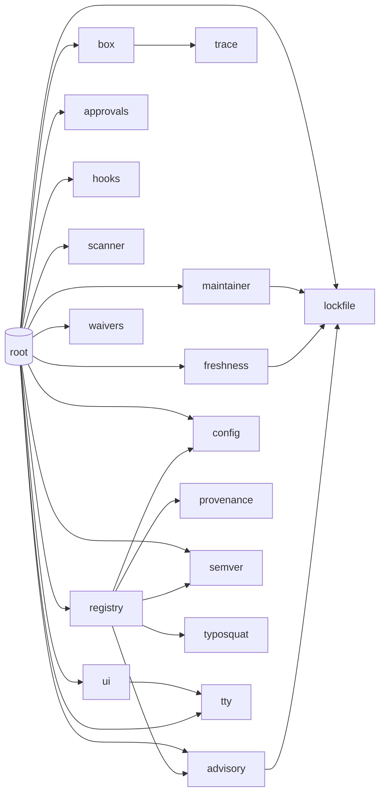

# depguard — Code Map

Where everything lives, what calls what, and where to make which kind of change.
Companion to [DESIGN.md](../DESIGN.md) (the *why*) and [README.md](../README.md) (the *how to use*).

> **Before you finish a change, update the docs.** [CLAUDE.md](../CLAUDE.md) maps every
> `.md` file to what triggers an edit (change a flag → README; change a layer guarantee →
> DESIGN + README; move a file → this code map).

## Layout

```
 depguard/
 ├── main.go                     CLI dispatch + the install/check orchestration
 ├── mcp.go                      `guard mcp`: stdio JSON-RPC MCP server (zero-dep)
 ├── go.mod                      module def — ZERO dependencies, on purpose
 ├── internal/
 │   ├── config/config.go        .guardrc policy: parse, defaults, validation
 │   ├── approvals/approvals.go  .guard-approvals: ask-once script decisions
 │   ├── waivers/waivers.go      .guard-ignores: reviewed-finding waivers (suppress check gates)
 │   ├── ui/ui.go                tiny NO_COLOR-aware ANSI color helper (status + check glyphs)
 │   ├── registry/proxy.go       ephemeral filtering proxy (cooldown + typosquat +
 │   │                           OSV + signature + dependency-confusion gates)
 │   ├── scanner/scanner.go      static scan: scripts + capability + LLM-injection
 │   ├── scanner/tarball.go      scan a published tarball → capability diff
 │   ├── typosquat/typosquat.go  name-level filter: Damerau-1 + homoglyph
 │   ├── provenance/provenance.go npm ECDSA dist.signature verification (stdlib)
 │   ├── maintainer/maintainer.go publisher-change / account-takeover detection
 │   ├── freshness/freshness.go  cooldown re-check on lockfile versions + LatestSafe (pin target)
│   ├── secrets/secrets.go      secret-file gate: git staged/tracked vs secret-paths globs
 │   ├── advisory/osv.go         OSV.dev known-bad feed client (Check = batch ids;
 │   │                           Severities = per-vuln detail for tiering; Blocks)
 │   ├── box/box.go              docker/podman sealed+traced+seccomp script runner
 │   ├── trace/trace.go          strace-log → evidence + safe/unsafe verdict
 │   ├── hooks/hooks.go          git hooks (chains onto husky), .npmrc, CI writers
 │   ├── lockfile/lockfile.go    package-lock.json reader (source of truth)
 │   ├── lockfile/altlock.go     pnpm-lock.yaml + yarn.lock parsers (check path)
 │   ├── semver/semver.go        minimal version compare (dist-tag repointing)
 │   └── tty/                    "is a human attached?" (termios; /dev/null lies)
 ├── docs/CODEMAP.md             this file
 ├── DESIGN.md                   the agreed design contract
 ├── SETUP.md                    step-by-step per-repo onboarding + tips
 ├── demo/                       runnable live demo (safe; unroutable doc IPs)
 │   ├── packages.mjs            the cast: benign, false-positive, exfil, etc.
 │   └── run.mjs                 narrates guard handling each, asserts outcomes
 └── test/                       vitest black-box e2e suite (runs the real binary)
     ├── helpers/registry.mjs    mock npm registry w/ fabricated publish ages
     ├── helpers/tar.mjs         hand-rolled USTAR+gzip (zero test deps)
     ├── helpers/run.mjs         temp projects + binary spawner
     └── *.test.mjs              cooldown / scripts / init suites
```

## Flow: `guard install` (and `guard ci`)

```
 main.cmdInstall
   │
   ├─ config.Load ──────────── .guardrc (validates registry is https/loopback)
   ├─ approvals.Load ───────── .guard-approvals
   │
   ├─ registry.Start ───────── proxy on 127.0.0.1:random, THIS command only
   │     └─ servePackument → rewrite():  allowlist bypass → typosquat/homoglyph
   │                          NAME gate (empties versions, fail closed) →
   │                          cooldown filter + dist-tags.latest repoint
   │                          (semver.MaxStable); fails CLOSED on rewrite errors
   │
   ├─ exec npm install/ci ──── --registry=proxy --ignore-scripts (flags win over .npmrc)
   ├─ report proxy.BlockedVersions()
   │
   ├─ handleScripts            for each lockfile entry (lockfile.InstalledPaths):
   │     ├─ scanner.ReadScripts ── cheap gate: ~90% exit here (no scripts)
   │     ├─ scanner.ScanDir ────── full capability sweep, script-bearing only
   │     ├─ approvals.Get / promptApproval (tty.IsTerminal gates the ask)
   │     ├─ box.EnsureObsImage ─── lazy: builds strace image on first script
   │     └─ runApproved
   │           ├─ box.Run ──────────── docker: net=none, ro tree, own dir rw,
   │           │     │                 cap-drop ALL, no-new-privileges,
   │           │     │                 pids-limit, digest-pinned image,
   │           │     │                 strace -f over network/openat/execve
   │           │     ├─ trace.Parse ── log → observations + Unsafe verdict
   │           │     └─ Unsafe? ────── pkg dir RESTORED from pre-run backup,
   │           │                       approval auto-flipped to Denied (committed)
   │           ├─ box.RunUncontained ─ ONLY if explicitly approved; env scrubbed
   │           └─ skip + explain ───── approved-boxed but no runtime here
   │
   ├─ runRootScripts ───────── the repo's OWN lifecycle scripts (trusted, incl. prepare)
   └─ checkAdvisories ──────── advisory.Check (OSV batch) on the final lockfile,
                              then enrichSeverities + partitionBySeverity (tiering)
```

## Flow: `guard check` (what hooks + CI run)

```
 main.cmdCheck (--confirm enables the interactive warn-tier accept flow)
   ├─ checkAdvisories ── lockfile.Installed → advisory.Check (OSV)
   │                     fail-open on network errors (loud warning)
   │                     → enrichSeverities (advisory.Severities, per-vuln detail)
   │                     → partitionBySeverity: blockers gate, warns don't
   │                     → confirmThroughWarnings (--confirm, /dev/tty): on "yes"
   │                       records acceptances via waivers.Set → .guard-ignores
   └─ checkFreshness ─── scope = lockfile versions ADDED since git HEAD
                         (headLockfile via `git show`; --all = full tree)
                         → freshness.Check: publish dates from registry,
                           violations fail the commit/PR; allowlist skipped
```

Every gating finding is first run through `.guard-ignores` (`internal/waivers`): an
actively-waived `<kind>:<name>@<version>` is shown muted and does **not** gate; an
expired waiver re-gates (fail closed). The same filter runs inside `gatherCheck`, so
`--json` / MCP (`CheckResult.waived`) agree with the human output.

This is the enforcement point for installs that **bypassed guard** (plain npm,
npx, a teammate without it): the bad version can reach node_modules, but not
the shared history.

## Flow: `guard init`

```
 main.cmdInit
   ├─ config.WriteDefault ── .guardrc (refuses to overwrite)
   └─ hooks.Install
        ├─ installNpmrc ──── ignore-scripts=true (appends; never duplicates,
        │                    never overrides an existing human choice)
        ├─ pre-commit/pre-push shims → call global `guard check --quiet`
        └─ --ci: .github/workflows/depguard.yml (deliberate FIXME — you must
                 pin YOUR release URL + checksum; no floating tags)
```

## Where to change what

| Change | Touch |
|---|---|
| New version-filter rule | `registry/proxy.go` `rewrite()` — add a filter, keep fail-closed |
| Typosquat list / distance rule | `typosquat/typosquat.go` (`popular`, `known`, `Suspicion`) |
| New static-scan capability signal | `scanner/scanner.go` `capabilityPatterns` table |
| New LLM-injection signal | `scanner/scanner.go` `injectionPatterns` / `isBidiControl` / `isZeroWidth` |
| New MCP tool | `mcp.go` `toolDefs()` + `callTool()` — keep the untrusted-data banner |
| Signature/keyring behavior | `provenance/provenance.go`; wired in `proxy.go` `rewrite()` |
| Maintainer-change heuristic | `maintainer/maintainer.go` `changesFor()` |
| Another lockfile format | `lockfile/altlock.go` + dispatch in `lockfile.go` `Installed()` |
| New `.guardrc` key | `config/config.go` `Load()` switch + `WriteDefault` starter |
| Secret-file gate behavior | `secrets/secrets.go` (`Find` / `matchAny` / `gitFiles`); wired in `main.go` `checkSecrets` + `gatherCheck` |
| Cooldown accept-all / auto-pin | `main.go` `confirmCooldown` / `pinAndReinstall` / `pinPackageJSON` / `setDepVersion`; pin target from `freshness.LatestSafe` |
| New waiver-id kind | `main.go` `validWaiverID` + a `<kind>WaiverID` helper |
| Box hardening / seccomp | `box/box.go` `Run()` args + `seccompProfile` |
| New dynamic (syscall) signal | `trace/trace.go` — add a matcher; convict only on no-build-excuse behavior |
| Box hardening / different runtime | `box/box.go` `Run()` arg list; image digest + obs Dockerfile at top |
| Demo scenarios | `demo/packages.mjs` (entry + `expect` + `why`) |
| Policy file keys | `config/config.go` `Load()` switch + `WriteDefault` starter |
| New CLI command | `main.go` dispatch switch + a `cmdX` func |
| Waiver kind / ID scheme | `internal/waivers/waivers.go` + `main.go` `*WaiverID` helpers + `validWaiverID` |
| `guard status` rows | `main.go` `cmdStatus` (+ `hooks.Installed`, `box.Runtime`) — read-only, OFFLINE |
| Editable `.guardrc` key (allow/config) | `config/config.go` `canonicalValue` + `writeKeyLine`; surfaced by `cmdAllow`/`cmdConfig` |
| Terminal color | `internal/ui/ui.go` (gate = NO_COLOR + both streams TTY) |
| Approval semantics | `approvals/approvals.go` (decisions) + `main.go` `promptApproval`/`runApproved` |
| Hook/CI behavior | `hooks/hooks.go` (the shims) — they only ever call `guard check` |
| Another ecosystem (PyPI) | new siblings of `registry`/`lockfile`/`scanner`; `main.go` orchestration is npm-shaped today |

## Invariants — do not break

1. **Zero Go dependencies.** The guard must not be attackable through its own supply chain.
2. **Fail closed in the filter path** (proxy rewrite errors, missing timestamps); **fail open with loud warnings in the check path** (registry/OSV blips must not block every commit).
3. **Nothing persistent.** No daemon, no schedule; the proxy dies with the command.
4. **Never auto-run an unvetted script** — non-interactive contexts skip and explain, never decide.
5. **Prompts default to NO** (EOF, garbage input → deny).
6. **Approvals/policy are committed files** — changes are PR-reviewable security decisions.
7. **The trace convicts only on no-build-excuse behavior** (network reach-out, real-secret access). Spawns and writes are context, never convictions — false positives train humans to disable the tool. New `trace` matchers must hold this line.
8. **The strace log is written to a host-side temp dir** (`/obs`), never inside the package's writable mount — the traced script must not be able to doctor its own evidence.
---

## Generated reference (AST graph)

_Auto-generated from a stdlib-only Go AST walk of the source tree (excludes `test/`, `_test.go`). 263 symbols, 290 intra-module call edges, 24 internal imports across 18 packages._

Symbols: **148 funcs, 28 methods, 31 types, 41 consts, 15 vars.**

### Package dependency graph



### Call-graph hubs

| Most-called (fan-in) | n | Biggest callers (fan-out) | n |
|---|--:|---|--:|
| `ui.OK`|10 | `(root).cmdStatus`|18 |
| `ui.paint`|9 | `(root).gatherCheck`|16 |
| `approvals.File.Get`|8 | `registry.Proxy.rewrite`|14 |
| `ui.Warn`|8 | `(root).cmdInstall`|13 |
| `config.Load`|7 | `(root).handleScripts`|13 |
| `approvals.File.Set`|6 | `(root).checkLockfileIntegrity`|12 |
| `lockfile.Installed`|6 | `(root).checkFreshness`|11 |
| `lockfile.Pkg.Key`|6 | `(root).main`|11 |
| `ui.Dim`|6 | `(root).checkAdvisories`|9 |
| `waivers.File.Check`|6 | `(root).cmdCheck`|9 |

### Symbol index

Per package: types and top-level functions/methods, with `file:line`.

<details><summary><code>(root)</code></summary>

**types:** `CheckResult`, `rpcError`, `rpcRequest`, `rpcResponse`  
**funcs:** `activeAdvisories` (main.go:629), `activeCooldown` (main.go:643), `advisoryWaiverID` (main.go:600), `approvalSummary` (main.go:1494), `boolState` (main.go:1456), `callTool` (mcp.go:142), `checkAdvisories` (main.go:1050), `checkFreshness` (main.go:947), `checkLockfileIntegrity` (main.go:734), `checkMaintainers` (main.go:875), `cmdAllow` (main.go:1541), `cmdApprove` (main.go:1151), `cmdCheck` (main.go:512), `cmdConfig` (main.go:1568), `cmdIgnore` (main.go:1199), `cmdInit` (main.go:112), `cmdInstall` (main.go:164), `cmdMCP` (mcp.go:50), `cmdScan` (main.go:1108), `cmdStatus` (main.go:1353), `cooldownWaiverID` (main.go:605), `dispatchMCP` (mcp.go:73), `fmtCooldown` (main.go:1440), `gatherCheck` (main.go:661), `gitTracked` (main.go:1488), `handleScripts` (main.go:265), `headLockfile` (main.go:1036), `hostOf` (main.go:801), `isLoopbackHost` (main.go:811), `listOrNone` (main.go:1448), `lookState` (main.go:1479), `main` (main.go:44), `npmrcState` (main.go:1464), `offRegistryWaiverID` (main.go:610), `printConfig` (main.go:1598), `priorCapabilityDiff` (main.go:817), `priorVersion` (main.go:850), `promptApproval` (main.go:360), `promptYN` (main.go:1318), `reportNewDeps` (main.go:912), `runApproved` (main.go:405), `runRootScripts` (main.go:476), `stdinIsTTY` (main.go:1314), `tail` (main.go:1338), `toolDefs` (mcp.go:103), `toolError` (mcp.go:210), `toolText` (mcp.go:189), `toolTextNote` (mcp.go:196), `truncate` (main.go:1329), `unhashedWaiverID` (main.go:611), `usage` (main.go:90), `validWaiverID` (main.go:1299), `waivedActive` (main.go:622), `waiverReason` (main.go:614), `waiverSummary` (main.go:1514)

</details>

<details><summary><code>advisory</code></summary>

**types:** `Vuln`  
**funcs:** `Check` (internal/advisory/osv.go:55), `CheckVersions` (internal/advisory/osv.go:34)

</details>

<details><summary><code>approvals</code></summary>

**types:** `Decision`, `Entry`, `File`  
**funcs:** `File.Get` (internal/approvals/approvals.go:65), `File.Save` (internal/approvals/approvals.go:81), `File.Set` (internal/approvals/approvals.go:71), `Load` (internal/approvals/approvals.go:46)

</details>

<details><summary><code>box</code></summary>

**types:** `Result`  
**funcs:** `EnsureObsImage` (internal/box/box.go:109), `Result.Summary` (internal/box/box.go:344), `Run` (internal/box/box.go:153), `RunUncontained` (internal/box/box.go:303), `Runtime` (internal/box/box.go:95), `ensureSeccompProfile` (internal/box/box.go:85), `snapshot` (internal/box/box.go:326)

</details>

<details><summary><code>config</code></summary>

**types:** `Config`, `FallbackMode`  
**funcs:** `AddAllow` (internal/config/config.go:360), `Config.Allowed` (internal/config/config.go:160), `Config.Flagged` (internal/config/config.go:174), `Config.Internal` (internal/config/config.go:186), `Defaults` (internal/config/config.go:65), `Load` (internal/config/config.go:79), `SetValue` (internal/config/config.go:347), `WriteDefault` (internal/config/config.go:215), `canonicalValue` (internal/config/config.go:379), `parseBool` (internal/config/config.go:203), `parseDays` (internal/config/config.go:311), `parseList` (internal/config/config.go:323), `validateRegistry` (internal/config/config.go:293), `writeKeyLine` (internal/config/config.go:429)

</details>

<details><summary><code>freshness</code></summary>

**types:** `Violation`  
**funcs:** `Check` (internal/freshness/freshness.go:39), `publishTime` (internal/freshness/freshness.go:83)

</details>

<details><summary><code>hooks</code></summary>

**types:** `InstalledState`  
**funcs:** `Install` (internal/hooks/hooks.go:136), `Installed` (internal/hooks/hooks.go:195), `hookCallsGuard` (internal/hooks/hooks.go:212), `installHook` (internal/hooks/hooks.go:89), `installNpmrc` (internal/hooks/hooks.go:117)

</details>

<details><summary><code>lockfile</code></summary>

**types:** `Entry`, `Pkg`  
**funcs:** `Installed` (internal/lockfile/lockfile.go:68), `InstalledBytes` (internal/lockfile/lockfile.go:87), `InstalledPaths` (internal/lockfile/lockfile.go:50), `Pkg.Key` (internal/lockfile/lockfile.go:46), `dedupe` (internal/lockfile/lockfile.go:99), `dedupePkgs` (internal/lockfile/lockfile.go:116), `parse` (internal/lockfile/lockfile.go:131), `parseBytes` (internal/lockfile/lockfile.go:140), `parsePnpm` (internal/lockfile/altlock.go:16), `parseYarn` (internal/lockfile/altlock.go:79), `splitPnpmKey` (internal/lockfile/altlock.go:60), `yarnName` (internal/lockfile/altlock.go:114)

</details>

<details><summary><code>maintainer</code></summary>

**types:** `Change`  
**funcs:** `Check` (internal/maintainer/maintainer.go:46), `changesFor` (internal/maintainer/maintainer.go:96)

</details>

<details><summary><code>provenance</code></summary>

**types:** `Keyring`, `Signature`  
**funcs:** `FetchKeyring` (internal/provenance/provenance.go:40), `Keyring.Verify` (internal/provenance/provenance.go:86)

</details>

<details><summary><code>registry</code></summary>

**types:** `Blocked`, `Proxy`  
**funcs:** `Proxy.BlockedVersions` (internal/registry/proxy.go:97), `Proxy.DeprecatedVersions` (internal/registry/proxy.go:343), `Proxy.Stop` (internal/registry/proxy.go:94), `Proxy.URL` (internal/registry/proxy.go:91), `Proxy.block` (internal/registry/proxy.go:329), `Proxy.handle` (internal/registry/proxy.go:106), `Proxy.keys` (internal/registry/proxy.go:59), `Proxy.note` (internal/registry/proxy.go:336), `Proxy.rewrite` (internal/registry/proxy.go:171), `Proxy.servePackument` (internal/registry/proxy.go:118), `Proxy.streamTarball` (internal/registry/proxy.go:316), `Start` (internal/registry/proxy.go:71), `distSignatures` (internal/registry/proxy.go:351), `hostOf` (internal/registry/proxy.go:378), `humanDays` (internal/registry/proxy.go:391), `isLoopbackHost` (internal/registry/proxy.go:388), `parseTime` (internal/registry/proxy.go:400)

</details>

<details><summary><code>scanner</code></summary>

**types:** `Finding`, `Report`, `Severity`, `finder`  
**funcs:** `DiffNew` (internal/scanner/tarball.go:81), `FetchReport` (internal/scanner/tarball.go:57), `ReadScripts` (internal/scanner/scanner.go:133), `Report.HasInstallScripts` (internal/scanner/scanner.go:67), `ScanDir` (internal/scanner/scanner.go:155), `ScanTarball` (internal/scanner/tarball.go:24), `Severity.MarshalJSON` (internal/scanner/scanner.go:45), `Severity.String` (internal/scanner/scanner.go:32), `isBidiControl` (internal/scanner/scanner.go:354), `isCodeFile` (internal/scanner/scanner.go:334), `isTextFile` (internal/scanner/scanner.go:338), `isZeroWidth` (internal/scanner/scanner.go:365), `lineAt` (internal/scanner/scanner.go:313), `readCapped` (internal/scanner/scanner.go:318), `scanFile` (internal/scanner/scanner.go:197), `scanInjection` (internal/scanner/scanner.go:263), `scanPatterns` (internal/scanner/scanner.go:243)

</details>

<details><summary><code>semver</code></summary>

**types:** `Version`  
**funcs:** `Less` (internal/semver/semver.go:52), `MaxStable` (internal/semver/semver.go:78), `Parse` (internal/semver/semver.go:24)

</details>

<details><summary><code>trace</code></summary>

**types:** `Kind`, `Observation`, `Report`  
**funcs:** `Parse` (internal/trace/trace.go:77), `decodeDNSName` (internal/trace/trace.go:159), `isLoopback` (internal/trace/trace.go:152), `isSecretPath` (internal/trace/trace.go:137)

</details>

<details><summary><code>tty</code></summary>

**funcs:** `IsTerminal` (internal/tty/tty_unix.go:19), `IsTerminal` (internal/tty/tty_windows.go:10), `IsTerminalFd` (internal/tty/tty_unix.go:24), `IsTerminalFd` (internal/tty/tty_windows.go:14)

</details>

<details><summary><code>typosquat</code></summary>

**funcs:** `Suspicion` (internal/typosquat/typosquat.go:51), `abs` (internal/typosquat/typosquat.go:146), `firstNonASCIILetter` (internal/typosquat/typosquat.go:133), `min3` (internal/typosquat/typosquat.go:153), `osaDistance` (internal/typosquat/typosquat.go:91), `quote` (internal/typosquat/typosquat.go:142), `quoteRune` (internal/typosquat/typosquat.go:144)

</details>

<details><summary><code>ui</code></summary>

**funcs:** `Bad` (internal/ui/ui.go:39), `Bold` (internal/ui/ui.go:47), `Dim` (internal/ui/ui.go:46), `Enabled` (internal/ui/ui.go:26), `Green` (internal/ui/ui.go:43), `OK` (internal/ui/ui.go:37), `Red` (internal/ui/ui.go:45), `SetEnabled` (internal/ui/ui.go:23), `Waived` (internal/ui/ui.go:40), `Warn` (internal/ui/ui.go:38), `Yellow` (internal/ui/ui.go:44), `paint` (internal/ui/ui.go:29)

</details>

<details><summary><code>waivers</code></summary>

**types:** `Entry`, `File`, `Status`  
**funcs:** `File.Check` (internal/waivers/waivers.go:90), `File.IDs` (internal/waivers/waivers.go:139), `File.Remove` (internal/waivers/waivers.go:130), `File.Save` (internal/waivers/waivers.go:150), `File.Set` (internal/waivers/waivers.go:116), `Load` (internal/waivers/waivers.go:55), `normalizeExpiry` (internal/waivers/waivers.go:160)

</details>
