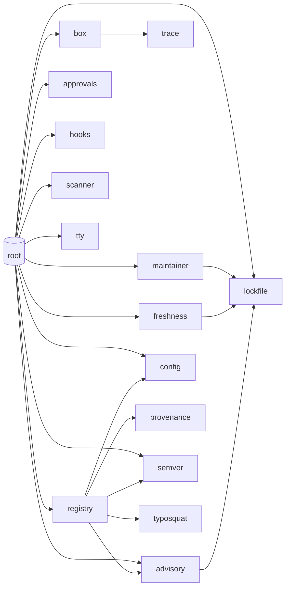

# depguard — Code Map

Where everything lives, what calls what, and where to make which kind of change.
Companion to [DESIGN.md](../DESIGN.md) (the *why*) and [README.md](../README.md) (the *how to use*).

## Layout

```
 depguard/
 ├── main.go                     CLI dispatch + the install/check orchestration
 ├── mcp.go                      `guard mcp`: stdio JSON-RPC MCP server (zero-dep)
 ├── go.mod                      module def — ZERO dependencies, on purpose
 ├── internal/
 │   ├── config/config.go        .guardrc policy: parse, defaults, validation
 │   ├── approvals/approvals.go  .guard-approvals: ask-once script decisions
 │   ├── registry/proxy.go       ephemeral filtering proxy (cooldown + typosquat +
 │   │                           OSV + signature + dependency-confusion gates)
 │   ├── scanner/scanner.go      static scan: scripts + capability + LLM-injection
 │   ├── scanner/tarball.go      scan a published tarball → capability diff
 │   ├── typosquat/typosquat.go  name-level filter: Damerau-1 + homoglyph
 │   ├── provenance/provenance.go npm ECDSA dist.signature verification (stdlib)
 │   ├── maintainer/maintainer.go publisher-change / account-takeover detection
 │   ├── freshness/freshness.go  cooldown re-check on lockfile versions
 │   ├── advisory/osv.go         OSV.dev known-bad feed client
 │   ├── box/box.go              docker/podman sealed+traced+seccomp script runner
 │   ├── trace/trace.go          strace-log → evidence + safe/unsafe verdict
 │   ├── hooks/hooks.go          git hooks (chains onto husky), .npmrc, CI writers
 │   ├── lockfile/lockfile.go    package-lock.json reader (source of truth)
 │   ├── lockfile/altlock.go     pnpm-lock.yaml + yarn.lock parsers (check path)
 │   ├── semver/semver.go        minimal version compare (dist-tag repointing)
 │   └── tty/                    "is a human attached?" (termios; /dev/null lies)
 ├── docs/CODEMAP.md             this file
 ├── DESIGN.md                   the agreed design contract
 ├── demo/                       runnable live demo (safe; unroutable doc IPs)
 │   ├── packages.mjs            the cast: benign, false-positive, exfil, etc.
 │   └── run.mjs                 narrates guard handling each, asserts outcomes
 └── test/                       vitest black-box e2e suite (runs the real binary)
     ├── helpers/registry.mjs    mock npm registry w/ fabricated publish ages
     ├── helpers/tar.mjs         hand-rolled USTAR+gzip (zero test deps)
     ├── helpers/run.mjs         temp projects + binary spawner
     └── *.test.mjs              cooldown / scripts / init suites
```

## Flow: `guard install` (and `guard ci`)

```
 main.cmdInstall
   │
   ├─ config.Load ──────────── .guardrc (validates registry is https/loopback)
   ├─ approvals.Load ───────── .guard-approvals
   │
   ├─ registry.Start ───────── proxy on 127.0.0.1:random, THIS command only
   │     └─ servePackument → rewrite():  allowlist bypass → typosquat/homoglyph
   │                          NAME gate (empties versions, fail closed) →
   │                          cooldown filter + dist-tags.latest repoint
   │                          (semver.MaxStable); fails CLOSED on rewrite errors
   │
   ├─ exec npm install/ci ──── --registry=proxy --ignore-scripts (flags win over .npmrc)
   ├─ report proxy.BlockedVersions()
   │
   ├─ handleScripts            for each lockfile entry (lockfile.InstalledPaths):
   │     ├─ scanner.ReadScripts ── cheap gate: ~90% exit here (no scripts)
   │     ├─ scanner.ScanDir ────── full capability sweep, script-bearing only
   │     ├─ approvals.Get / promptApproval (tty.IsTerminal gates the ask)
   │     ├─ box.EnsureObsImage ─── lazy: builds strace image on first script
   │     └─ runApproved
   │           ├─ box.Run ──────────── docker: net=none, ro tree, own dir rw,
   │           │     │                 cap-drop ALL, no-new-privileges,
   │           │     │                 pids-limit, digest-pinned image,
   │           │     │                 strace -f over network/openat/execve
   │           │     ├─ trace.Parse ── log → observations + Unsafe verdict
   │           │     └─ Unsafe? ────── pkg dir RESTORED from pre-run backup,
   │           │                       approval auto-flipped to Denied (committed)
   │           ├─ box.RunUncontained ─ ONLY if explicitly approved; env scrubbed
   │           └─ skip + explain ───── approved-boxed but no runtime here
   │
   ├─ runRootScripts ───────── the repo's OWN lifecycle scripts (trusted, incl. prepare)
   └─ checkAdvisories ──────── advisory.Check (OSV batch) on the final lockfile
```

## Flow: `guard check` (what hooks + CI run)

```
 main.cmdCheck
   ├─ checkAdvisories ── lockfile.Installed → advisory.Check (OSV)
   │                     fail-open on network errors (loud warning)
   └─ checkFreshness ─── scope = lockfile versions ADDED since git HEAD
                         (headLockfile via `git show`; --all = full tree)
                         → freshness.Check: publish dates from registry,
                           violations fail the commit/PR; allowlist skipped
```

This is the enforcement point for installs that **bypassed guard** (plain npm,
npx, a teammate without it): the bad version can reach node_modules, but not
the shared history.

## Flow: `guard init`

```
 main.cmdInit
   ├─ config.WriteDefault ── .guardrc (refuses to overwrite)
   └─ hooks.Install
        ├─ installNpmrc ──── ignore-scripts=true (appends; never duplicates,
        │                    never overrides an existing human choice)
        ├─ pre-commit/pre-push shims → call global `guard check --quiet`
        └─ --ci: .github/workflows/depguard.yml (deliberate FIXME — you must
                 pin YOUR release URL + checksum; no floating tags)
```

## Where to change what

| Change | Touch |
|---|---|
| New version-filter rule | `registry/proxy.go` `rewrite()` — add a filter, keep fail-closed |
| Typosquat list / distance rule | `typosquat/typosquat.go` (`popular`, `known`, `Suspicion`) |
| New static-scan capability signal | `scanner/scanner.go` `capabilityPatterns` table |
| New LLM-injection signal | `scanner/scanner.go` `injectionPatterns` / `isBidiControl` / `isZeroWidth` |
| New MCP tool | `mcp.go` `toolDefs()` + `callTool()` — keep the untrusted-data banner |
| Signature/keyring behavior | `provenance/provenance.go`; wired in `proxy.go` `rewrite()` |
| Maintainer-change heuristic | `maintainer/maintainer.go` `changesFor()` |
| Another lockfile format | `lockfile/altlock.go` + dispatch in `lockfile.go` `Installed()` |
| New `.guardrc` key | `config/config.go` `Load()` switch + `WriteDefault` starter |
| Box hardening / seccomp | `box/box.go` `Run()` args + `seccompProfile` |
| New dynamic (syscall) signal | `trace/trace.go` — add a matcher; convict only on no-build-excuse behavior |
| Box hardening / different runtime | `box/box.go` `Run()` arg list; image digest + obs Dockerfile at top |
| Demo scenarios | `demo/packages.mjs` (entry + `expect` + `why`) |
| Policy file keys | `config/config.go` `Load()` switch + `WriteDefault` starter |
| New CLI command | `main.go` dispatch switch + a `cmdX` func |
| Approval semantics | `approvals/approvals.go` (decisions) + `main.go` `promptApproval`/`runApproved` |
| Hook/CI behavior | `hooks/hooks.go` (the shims) — they only ever call `guard check` |
| Another ecosystem (PyPI) | new siblings of `registry`/`lockfile`/`scanner`; `main.go` orchestration is npm-shaped today |

## Invariants — do not break

1. **Zero Go dependencies.** The guard must not be attackable through its own supply chain.
2. **Fail closed in the filter path** (proxy rewrite errors, missing timestamps); **fail open with loud warnings in the check path** (registry/OSV blips must not block every commit).
3. **Nothing persistent.** No daemon, no schedule; the proxy dies with the command.
4. **Never auto-run an unvetted script** — non-interactive contexts skip and explain, never decide.
5. **Prompts default to NO** (EOF, garbage input → deny).
6. **Approvals/policy are committed files** — changes are PR-reviewable security decisions.
7. **The trace convicts only on no-build-excuse behavior** (network reach-out, real-secret access). Spawns and writes are context, never convictions — false positives train humans to disable the tool. New `trace` matchers must hold this line.
8. **The strace log is written to a host-side temp dir** (`/obs`), never inside the package's writable mount — the traced script must not be able to doctor its own evidence.
---

## Generated reference (AST graph)

_Auto-generated from a stdlib-only Go AST walk of the source tree (excludes `test/`, `_test.go`). 202 symbols, 170 intra-module call edges, 23 internal imports across 16 packages._

Symbols: **103 funcs, 23 methods, 27 types, 35 consts, 14 vars.**

### Package dependency graph



### Call-graph hubs

| Most-called (fan-in) | n | Biggest callers (fan-out) | n |
|---|--:|---|--:|
| `approvals.File.Get`|6 | `(root).handleScripts`|13 |
| `lockfile.Pkg.Key`|6 | `registry.Proxy.rewrite`|12 |
| `lockfile.Installed`|6 | `(root).cmdInstall`|11 |
| `config.Load`|4 | `(root).gatherCheck`|10 |
| `(root).truncate`|4 | `(root).cmdCheck`|8 |
| `advisory.Check`|3 | `(root).main`|7 |
| `lockfile.parseBytes`|3 | `(root).runApproved`|6 |
| `scanner.ScanDir`|3 | `config.Load`|5 |
| `config.Config.Flagged`|3 | `lockfile.Installed`|5 |
| `approvals.File.Set`|3 | `typosquat.Suspicion`|5 |

### Symbol index

Per package: exported types and functions/methods (lowercase = unexported helpers omitted for brevity unless they are call-graph hubs).

<details><summary><code>(root)</code></summary>

**types:** `CheckResult`, `rpcError`, `rpcRequest`, `rpcResponse`  
**funcs:** `callTool` (mcp.go:134), `checkFreshness` (main.go:794), `checkLockfileIntegrity` (main.go:599), `cmdCheck` (main.go:463), `cmdInstall` (main.go:131), `gatherCheck` (main.go:539), `handleScripts` (main.go:216), `headLockfile` (main.go:864), `main` (main.go:40), `priorCapabilityDiff` (main.go:664), `reportNewDeps` (main.go:759), `runApproved` (main.go:356), `truncate` (main.go:1014)

</details>

<details><summary><code>advisory</code></summary>

**types:** `Vuln`  
**funcs:** `Check` (internal/advisory/osv.go:55), `CheckVersions` (internal/advisory/osv.go:34)

</details>

<details><summary><code>approvals</code></summary>

**types:** `Decision`, `Entry`, `File`  
**funcs:** `Load` (internal/approvals/approvals.go:46), `File.Get` (internal/approvals/approvals.go:65), `File.Save` (internal/approvals/approvals.go:81), `File.Set` (internal/approvals/approvals.go:71)

</details>

<details><summary><code>box</code></summary>

**types:** `Result`  
**funcs:** `EnsureObsImage` (internal/box/box.go:109), `Run` (internal/box/box.go:153), `RunUncontained` (internal/box/box.go:303), `Runtime` (internal/box/box.go:95), `Result.Summary` (internal/box/box.go:344)

</details>

<details><summary><code>config</code></summary>

**types:** `Config`, `FallbackMode`  
**funcs:** `Defaults` (internal/config/config.go:65), `Load` (internal/config/config.go:79), `WriteDefault` (internal/config/config.go:215), `Config.Allowed` (internal/config/config.go:160), `Config.Flagged` (internal/config/config.go:174), `Config.Internal` (internal/config/config.go:186)

</details>

<details><summary><code>freshness</code></summary>

**types:** `Violation`  
**funcs:** `Check` (internal/freshness/freshness.go:39)

</details>

<details><summary><code>hooks</code></summary>

**funcs:** `Install` (internal/hooks/hooks.go:118)

</details>

<details><summary><code>lockfile</code></summary>

**types:** `Entry`, `Pkg`  
**funcs:** `Installed` (internal/lockfile/lockfile.go:68), `InstalledBytes` (internal/lockfile/lockfile.go:87), `InstalledPaths` (internal/lockfile/lockfile.go:50), `dedupe` (internal/lockfile/lockfile.go:99), `parseBytes` (internal/lockfile/lockfile.go:140), `Pkg.Key` (internal/lockfile/lockfile.go:46)

</details>

<details><summary><code>maintainer</code></summary>

**types:** `Change`  
**funcs:** `Check` (internal/maintainer/maintainer.go:46)

</details>

<details><summary><code>provenance</code></summary>

**types:** `Keyring`, `Signature`  
**funcs:** `FetchKeyring` (internal/provenance/provenance.go:40), `Keyring.Verify` (internal/provenance/provenance.go:86)

</details>

<details><summary><code>registry</code></summary>

**types:** `Blocked`, `Proxy`  
**funcs:** `Start` (internal/registry/proxy.go:71), `Proxy.BlockedVersions` (internal/registry/proxy.go:97), `Proxy.DeprecatedVersions` (internal/registry/proxy.go:343), `Proxy.Stop` (internal/registry/proxy.go:94), `Proxy.URL` (internal/registry/proxy.go:91), `Proxy.rewrite` (internal/registry/proxy.go:171)

</details>

<details><summary><code>scanner</code></summary>

**types:** `Finding`, `Report`, `Severity`, `finder`  
**funcs:** `DiffNew` (internal/scanner/tarball.go:81), `FetchReport` (internal/scanner/tarball.go:57), `ReadScripts` (internal/scanner/scanner.go:133), `ScanDir` (internal/scanner/scanner.go:155), `ScanTarball` (internal/scanner/tarball.go:24), `lineAt` (internal/scanner/scanner.go:313), `scanFile` (internal/scanner/scanner.go:197), `scanInjection` (internal/scanner/scanner.go:263), `Report.HasInstallScripts` (internal/scanner/scanner.go:67), `Severity.MarshalJSON` (internal/scanner/scanner.go:45), `Severity.String` (internal/scanner/scanner.go:32)

</details>

<details><summary><code>semver</code></summary>

**types:** `Version`  
**funcs:** `Less` (internal/semver/semver.go:52), `MaxStable` (internal/semver/semver.go:78), `Parse` (internal/semver/semver.go:24)

</details>

<details><summary><code>trace</code></summary>

**types:** `Kind`, `Observation`, `Report`  
**funcs:** `Parse` (internal/trace/trace.go:77)

</details>

<details><summary><code>tty</code></summary>

**funcs:** `IsTerminal` (internal/tty/tty_unix.go:19), `IsTerminal` (internal/tty/tty_windows.go:10)

</details>

<details><summary><code>typosquat</code></summary>

**funcs:** `Suspicion` (internal/typosquat/typosquat.go:51)

</details>

